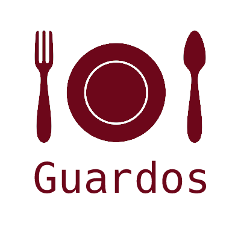

<div align="center">
  <a>
    
  </a>
</div>

# Guardos
### **To find restaurants according to your food profile.**

</br>

<!-- GETTING STARTED -->
## Getting Started

To get a local copy up and running follow these simple steps.

### Prerequisites

What do you need ? :

<a href="https://nodejs.org/en/download/">
Node
</a>
</br>

### Installation

1. Clone the repo
   ```sh
   git clone git@github.com:Alban-de-tourtier/Guardos.git 'Guardos'
   ```
2. Go to the repo location
   ```sh
   cd Guardos
   ```
3. Install dependencies
   ```sh
   npm install
   ```
4. Run it
   ```sh
   npm run start
   ```

<!-- USAGE EXAMPLES -->
## Usage

You are ready, good job! Go to <a href="http://localhost:8080/">http://localhost:8080/</a>

